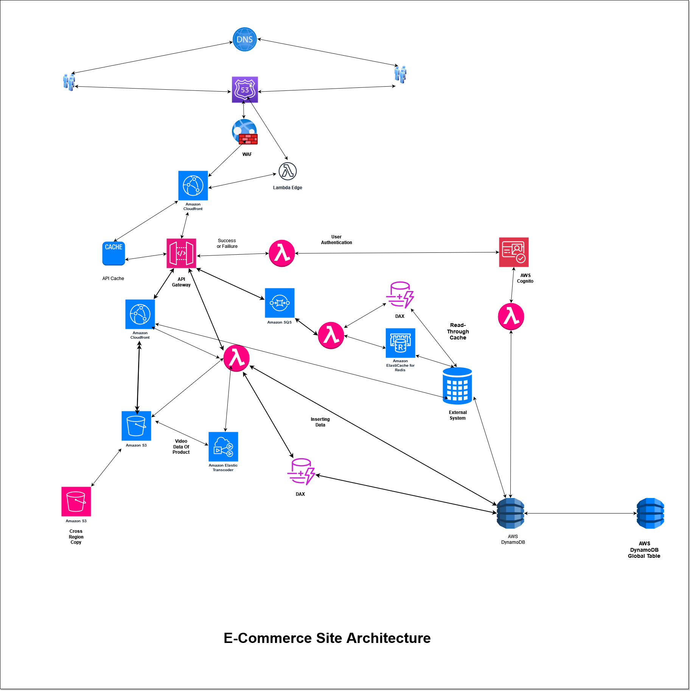

# Read Me

To create a scalable and cost-effective e-commerce site, we employ a microservices architecture.

Our design involves utilizing an API gateway and Lambda functions to add the product information to DynamoDB and the pictures and video of product into Amazon S3. For transcoding the videos into different formats, we use **Amazon Elastic Transcoder** and save it to Amazon S3. To retrieve and cache data, an external system is employed, and the cached data is stored in Amazon DynamoDB Accelerator (DAX) and Amazon CloudFront.

To handle potential **throttling errors** during data retrieval, **Amazon SQS** is employed in conjunction with Lambda. Additionally, for user authentication, we rely on Amazon Cognito and Lambda functions.

For efficient caching mechanisms, we leverage **Amazon CloudFront, Amazon DynamoDB Accelerator (DAX)**, and **Amazon Elastic Cache for Redis**.

For retrieving the data in less time for different regions, we use **Lambda Edge** function and may use Amazon API Gateway in that region in conjunction with **DynamoDB Global Table** and **Amazon CloudFront**. We also use Amazon **DynamoDB Accelerator (DAX) and CloudFront** for caching the data in that region too.

For DDOS protection and various security threats like brute-force , we use **Amazon WAF** and **Amazon Shield Standard.**

